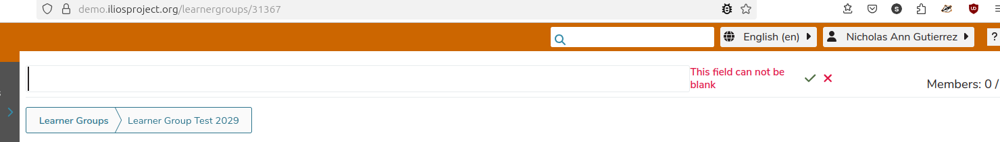
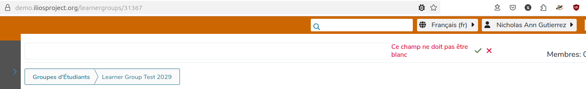

# Yup and Ilios


## What is Yup

>  Dead simple Object schema validation.

- source code: https://github.com/jquense/yup (~24k stars)
- npm: https://www.npmjs.com/package/yup (ca 7 million downloads to date, 6.5k+ dependents)


## Why did we move to Yup

Our current form validation subsystem is built on an earlier version of an EcmaScript proposal that seems to be stuck in draft.

Mainmatter recommended Yup as a replacement in their assessment feedback document.


- https://github.com/tc39/proposal-decorators
- https://tc39.es/proposal-decorators/
- https://mainmatter.notion.site/UCSF-Ember-Upgrade-Assessment-c5e697b049d44b1e820fb8781e1ba6c8#10e64e58ddfa80528bd1ca7394cb27fb
- https://mainmatter.com/blog/2021/12/08/validations-in-ember-apps/

## Usage in Ilios

We currently use Yup in 50 components.

```bash
$ grep -rl "from 'yup'" packages/ --exclude-dir=dist --exclude-dir=node_modules | grep components | wc -l
50
```

## Building Blocks

1. Yup itself
2. `YupValidations` class
3. `YupValidationMessage` component
4. customized/translated error messages


### YupValidations class

Uitility class that wraps Yup core functionality and provides functionality to register/track validation error output.

#### Instantiation

The constructor takes a context and a shape argument.

Context is usually the component that we want to validate, shape is an object that holds validation schemas for the "fields" that we want to validate


```js
  validations = new YupValidations(this, {
    name: string().trim().required().max(60),
    description: string().trim().required().max(21844),
  });
```

#### Public API

- `isValid()` - async method that triggers validation. returns a TRUE on success, FALSE otherwise.

- `addErrorDisplayFor(field)`, `addErrorDisplaysFor(field)`, `addErrorDisplayForAllFields()` - functions that register the given "field" (or fields) for validation output tracking.

- `removeErrorDisplayFor(field)`, `removeErrorDisplaysFor(fields)`, `clearErrorDisplay()` - functions that de-register fields from validation output tracking. 

- `attach()` - a modifier that attaches event handlers on input and on focus-out to a given input element. These event handlers will run form validation when triggered.

some examples:

```js
  save = restartableTask(async () => {
    this.validations.addErrorDisplayFor('title'); // Register error display for the "title" field
    // Run validations.
    const isValid = await this.validations.isValid(); 
    if (!isValid) {
      return false; // validation fails, do not proceed
    }
    // All good, keep going.
    this.validations.removeErrorDisplayFor('title'); // De-register error display for the "title" field
    // Do the thing...
    this.args.session.title = this.title; 
    await this.args.session.save();
  });
```

```html
    <input
        aria-label={{t "general.title"}}
        disabled={{isSaving}}
        type="text"
        value={{this.title}}
        {{on "input" (pick "target.value" (set this "title"))}}
        {{this.validations.attach "title"}}
    />
```

### YupValidationMessage component

Paints the validation error message (or messages) for a given field onto the page.


#### Arguments

- `@description` - a label for the validated field that will be interpolated into the error message, if applicable. _optional_
- `@validationErrors` - The validation error (or errors) for a given field to paint. _mandatory_

Example:

```html
    <YupValidationMessage
        @description={{t "general.title"}}
        @validationErrors={{this.validations.errors.title}}
    />
```

### Translatable error messages

Can be found in language-files in `packages/ilios-common/translations/` and `packages/frontend/translations/` directories.

Examples:

```yaml
errors:
  accepted: "{description} must be accepted"
  after: "{description} must be after {after}"
  agreementRequired: Agreement or alternate rationale is required for upload
  before: "{description} must be before {before}"
  blank: "{description} can not be blank"
  collection: "{description} must be a collection"
  confirmation: "{description} does not match {on}"
  date: "{description} must be a valid date"
```

```yaml
errors:
  accepted: "{description} doit être accepté"
  after: "{description} doit être après {after}"
  agreementRequired: Entente ou autre justification requise pour le téléchargement
  before: "{description} doit être avant {before}"
  blank: "{description} ne doit pas être blanc"
  collection: "{description} doit être un collection"
  confirmation: "{description} ne correspond pas de {on}"
  date: "{description} doit être une date valide"
```

The `description` value is interpolated from the`@description` value provided to `<YupValidationMessage>` as shown above. 
Other values (`before`, `after` etc.) have to be provided from within the schema definition.






## Known Issues and pitfalls

### Trimming text input

The Ilios backend does that on (almost all) given text data points during input denormalization.
Make sure to run `trim()` as part of the sub-schema definitions that pertain to text values.

### Multiple way to validate ranges

- for text, you can use `required()` or `min(1)` to validate against empty string. Pick one. Use `required()`.
- for integers, you can use `positive()` or `min(1)` to validate against non-posive numbers. Use `min(1)`.

### Email validation

Yup's `isEmail()` is not up to snuff and misaligned with the more restrictive equivalent in the backend. Import and use `isEmail()` from validator.js instead.

```js
import isEmail from 'validator/lib/isEmail';

// ...
validations = new YupValidations(this, {
    email: string()
      .ensure()
      .trim()
      .required()
      .max(100)
      .test(
        'email',
        (d) => {
          return {
            path: d.path,
            messageKey: 'errors.email',
          };
        },
        (value) => {
          // short-circuit on empty input - this is being caught by `required()` already.
          // that way, we don't end up with two separate validation errors on empty input.
          if ('' === value) {
            return true;
          }
          // Yup's email validation is misaligned with our backend counterpart.
          // See https://github.com/jquense/yup?tab=readme-ov-file#stringemailmessage-string--function-schema
          // So we'll continue using the email validation provided by validator.js.
          return isEmail(value);
        },
      ),
    }
);
```

### Multiple validation errors for a given field

We cannot short-circuit on first error due to multi-field sub-schemas.

**Proposed solution:** change `YupValidationMessage` to _only_ display the first error message for a given field. Make this behaviour configurable via an input argument. _to be implemented._


### Document and clean up `YupValidations` class

- add docblocks to (at least) methods that are part of the public API
- tidy up by in-lining the various customized error message handlers, they are _not_ reusable.


## Future improvements/ideas

- figure out how to [extend built-in schema definitions with new methods](https://github.com/jquense/yup?tab=readme-ov-file#extending-built-in-schema-with-new-methods) _(for example: a reusable working email validator)_.
- disable form submission buttons if validation fails